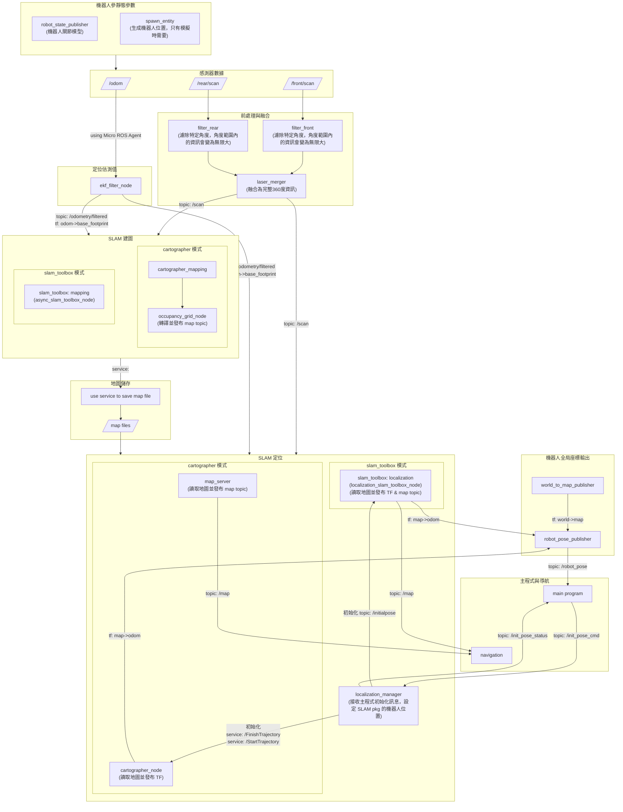
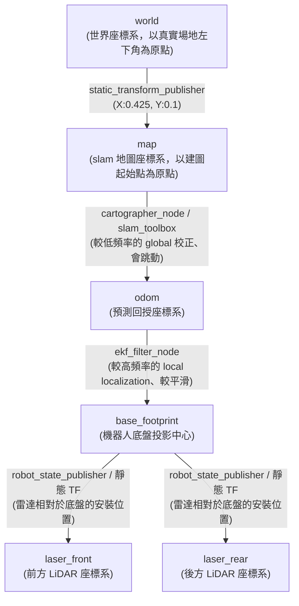

# TDK 30 Localization & Navigation

## Environment
### pre-installed pkgs and tools
- LiDAR plugin in Gazebo [source](https://classic.gazebosim.org/tutorials?tut=ros_gzplugins)
- ira_laser_tools: laserscan_multi_merger [source](https://github.com/nakai-omer/ira_laser_tools/tree/humble)
- rplidar_ros: S3 LiDAR firmware driver [source](https://github.com/Slamtec/rplidar_ros/tree/ros2)
<!-- - YDLidar-SDK: YD LiDAR basic firmware [source](https://github.com/wintera1233/YDLidar-SDK) -->
<!-- - ydlidar_ros2_driver: YD LiDAR driver for ROS2 [source](https://github.com/YDLIDAR/ydlidar_ros2_driver/tree/humble) -->
<!-- - phidgets_drivers: IMU firmware driver [source](https://github.com/ros-drivers/phidgets_drivers/tree/humble) -->

### How to setup
1. In local PC(Linux):
    ```bash
    git clone -b sim https://github.com/wang-hsiu-cheng/tdk_slam_ws.git
    cd docker && docker compose up
    docker exec -it tdk_slam bash
    ```
2. In local PC(Windows):
    > 確認 **VcXsrv（XLaunch）** 在工作列執行，且勾選 `Disable access control`
    ```powershell
    git clone -b sim https://github.com/wang-hsiu-cheng/tdk_slam_ws.git
    cd docker
    ./windows_docker_run.ps1
    docker exec -it tdk_slam bash
    ```
3. In container:
    ```bash
    colcon build --symlink-install
    source install/setup.bash
    ```
---

## Features
### Gazebo environment
- have virtual robot and virtual world
```bash
source install/setup.bash
ros2 launch tdk_slam_manager maze_world_launch.py
```

### SLAM Mapping
1. modify localization_mode in `sim_spawn_launch.py` (or `spawn_launch.py`)
    - slam toolbox, amcl: `mapping`
    - cartographer: `carto_mapping`
    ```py
    DeclareLaunchArgument('localization_mode', default_value='mapping')
    ```
2. (simulation)
    ```bash
    source install/setup.bash
    ros2 launch tdk_slam_manager sim_spawn_launch.py
    ```
3. (real world)
    ```bash
    source install/setup.bash
    ros2 launch tdk_slam_manager spawn_launch.py
    ```
4. remember to delete robot brfore reopen `sim_spawn_launch.py`: `ros2 service call /delete_entity gazebo_msgs/srv/DeleteEntity "{name: 'tdk_robot'}"`

5. Stop mapping and save map
    ```bash
    chmod +x save_map.sh
    ./save_map.sh slamtb # choose amcl, slamtb or carto to save in different types
    ```

### SLAM Localization
1. modify localization_mode in `sim_spawn_launch.py` (or `spawn_launch.py`)
    - slam toolbox: `slam_toolbox`
    - cartographer: `cartographer`
    - amcl: NOT AVAILABLE
    ```py
    DeclareLaunchArgument('localization_mode', default_value='slam_toolbox')
    ```
2. modify source map file name in `sim_spawn_launch.py` (or `spawn_launch.py`)
    ```py
    slam_map_file = os.path.join(localization_pkg, 'maps', 'slam_map_0.yaml')
    carto_map_file = os.path.join(localization_pkg, 'maps', 'carto_map_0.yaml')
    ``
3. Same steps as **SLAM Mapping** from Step 2 to Step 4

### Navigation
```bash
source install/setup.bash
ros2 launch tdk_nav2_manager nav_launch.py
```

### RViz
```bash
source install/setup.bash
rviz2
```

### Foxglove
1. In bash shell
    ```bash
    ros2 launch foxglove_bridge foxglove_bridge_launch.xml
    ```
2. on the browser
    - search **foxglove** and click **Open a new connection**
    - enter `ws://localhost:8765`

### Open Navigation server(robot_fsm_v2_ws)
```bash
source ~/tdk_slam_ws/install/setup.bash
source install/setup.bash
ros2 launch robot_navigation navigation_server.launch.py
```

### 測試兩個workspace通訊
```
ros2 action send_goal /navigate_to_named_pose robot_interfaces/action/NavigateToNamedPose "{target_name: 'stage1_entry', timeout_sec: 60.0}" --feedback
```
### 鍵盤開車
- 用teleop玩車的時候小心翻車。
```bash
source install/setup.bash
ros2 run teleop_twist_keyboard teleop_twist_keyboard
```

#### appendix: 開車按鍵速查

| 按鍵 | 動作 |
|------|------|
| `i` | 直走 |
| `,` | 倒退 |
| `j` | 左轉 |
| `l` | 右轉 |
| `u` | 左前 |
| `o` | 右前 |
| `k` | 停止 |
| `q` / `z` | 加速 / 減速 |
| `w` / `x` | 增加 / 減少線速度 |
| `e` / `c` | 增加 / 減少角速度 |
---

## File Structure
```bash
├── sensor_dep
│   ├── ira_laser_tools                     # laserscan_multi_merger
│   └── rplidar_ros                         # S3 LiDAR firmware driver
├── tdk_nav2_manager
└── tdk_slam_manager
    ├── CMakeLists.txt
    ├── package.xml
    ├── cartographer_config
    │   ├── cartographer_2d.lua             # cartographer 參數 (大部分設定都在這)
    │   └── localization.lua                # cartographer 參數 (上層)
    ├── config
    │   ├── laser_merger_params.yaml        # laser merger 參數
    │   ├── mapper_params_online_async.yaml # slam_toolbox 建圖參數
    │   ├── robot_params.yaml               # 機器人基本規格設定(由 URDF file 讀取)
    │   └── slam_toolbox_params.yaml        # slam_toolbox 定位參數
    ├── launch
    │   ├── maze_world_launch.py            # 開啟模擬環境
    │   ├── sim_spawn_launch.py             # for 模擬的 launch
    │   └── spawn_launch.py                 # for 真實機器的 launch
    ├── include
    │   └── localization_manager.hpp
    ├── src
    │   ├── laser_angle_filter.cpp          # 簡易版的 LiDAR 資訊過濾器
    │   ├── localization_manager.cpp        # 初始化機器人定位初始位置
    │   └── robot_pose_publisher.cpp        # 收聽 TF，發送我機定位結果
    ├── maps
    │   ├── carto_map_0.pbstream            # cartographer 建出來的 mapping 資訊，cartographer 在定位模式使用
    │   ├── carto_map_0.pgm                 
    │   ├── carto_map_0.yaml                # 轉換成 map_server 儲存格式
    │   ├── slam_map_0.data                 # slam_toolbox 建的圖
    │   └── slam_map_0.posegraph            # slam_toolbox 建的圖，slam_toolbox 在定位模式用於發送 /map topic
    ├── sim
    │   ├── models                          # 物件CAD檔 & 相關轉檔設定 (想知道可以問 yvonne)
    │   └── worlds                          # 把物件匯入 gazebo
    └── urdf
        └── sensors.urdf.xacro              # 機器人關節設定 (想知道可以問 yvonne)
```

## Project Structure

### Node Graph


### TF Tree
